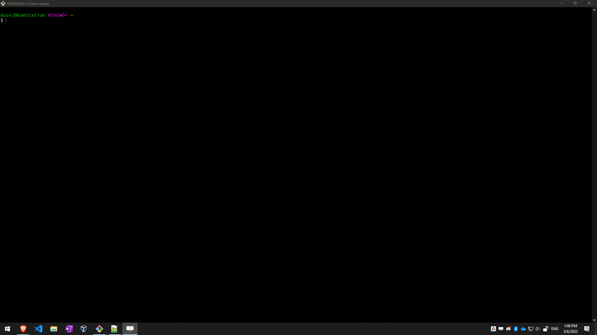
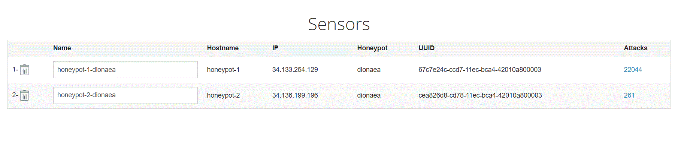
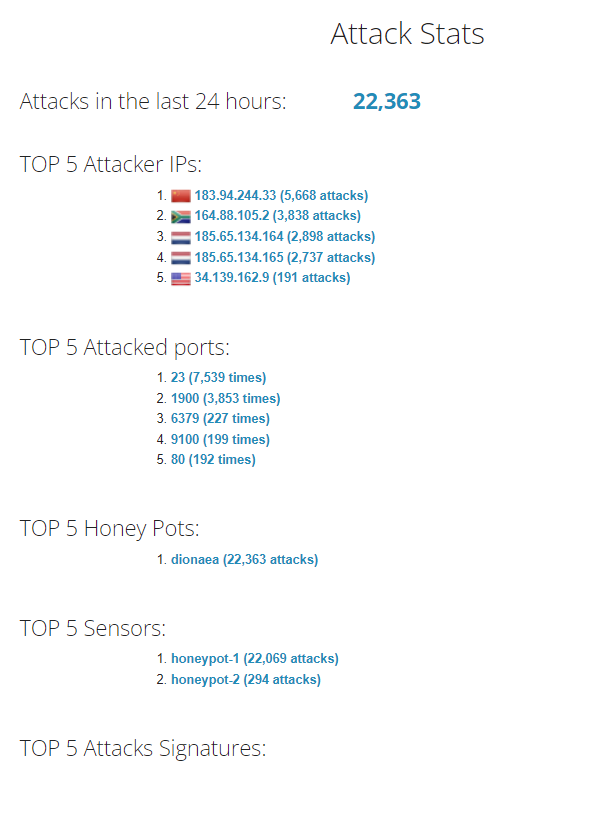
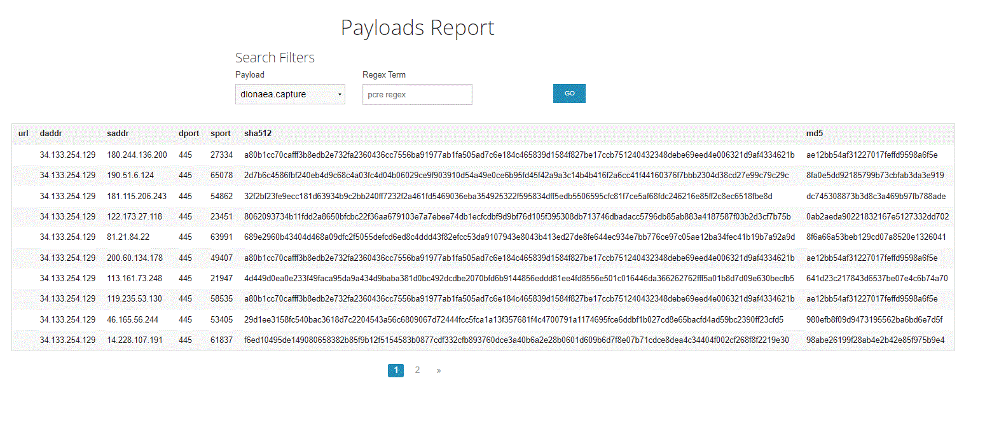

# Honeypot Assignment

**Time spent:** **9** hours spent in total

**Objective:** Create a honeynet using MHN-Admin. Present your findings as if you were requested to give a brief report of the current state of Internet security. Assume that your audience is a current employer who is questioning why the company should allocate anymore resources to the IT security team.

### MHN-Admin Deployment (Required)

**Summary:** MHN has been deployed on Google Cloud Platform

### Dionaea Honeypot Deployment (Required)

**Summary:** Dionaea captures attacking payloads and malware.

### Database Backup (Required) 

**Summary:** What is the RDBMS that MHN-Admin uses? What information does the exported JSON file record?

session.json file included in this repo

https://github.com/dusek2/codepath_homework/blob/1096fa6a0d0aa4079be6b99897bd602a9f9eef1b/session.json

### Deploying Additional Honeypot(s)

**Summary:** Additional Honeypots deployed in order to capture more payloads and malware

## Notes

No challenges encountered 
Most attacks come from IPs in China, South Africa Russia and USA

Payloads captured:

